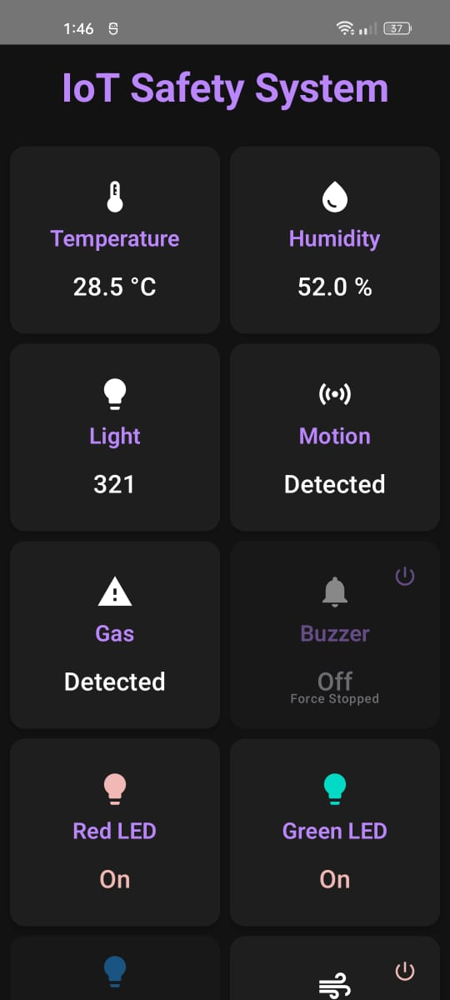
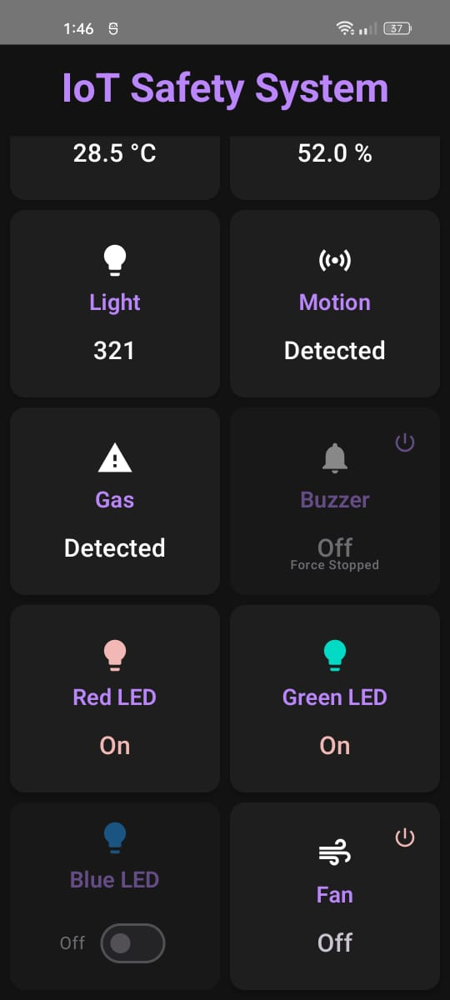

<h1>IoT Safety Monitor</h1>

  An IoT-based safety monitoring system powered by the ESP8266 microcontroller.
  This project integrates various sensors and actuators to detect hazardous environmental conditions and notify users in real-time through AWS IoT and a connected Android mobile app.

<h2>🔧 Features</h2>
<ul>
  <li>🌡️ <strong>DHT11 Sensor</strong>: Monitors temperature and humidity</li>
  <li>🔥 <strong>MQ2 Sensor</strong>: Detects smoke and combustible gases</li>
  <li>👀 <strong>PIR Sensor</strong>: Detects human motion for intrusion detection</li>
  <li>💡 <strong>LDR Sensor</strong>: Monitors light intensity to detect abnormal lighting</li>
  <li>🚨 <strong>Actuators</strong>: Buzzer and LEDs alert users to danger</li>
  <li>📱 <strong>Android App Integration</strong>: Real-time status updates and alerts</li>
  <li>☁️ <strong>AWS IoT Core</strong>: MQTT-based communication between the ESP8266 and the cloud</li>
  <li>🌐 <strong>ESP8266 Web Server</strong>: Onboard server for local monitoring via browser</li>
</ul>

<h2>📷 Android app preview</h2>

  
  

<h2>🛠️ Hardware Components</h2>
<ul>
  <li>NodeMCU ESP8266</li>
  <li>DHT11 Temperature & Humidity Sensor</li>
  <li>MQ2 Gas Sensor</li>
  <li>PIR Motion Sensor</li>
  <li>LDR Light Sensor</li>
  <li>Buzzer</li>
  <li>LEDs</li>
  <li>Resistors, breadboard, jumper wires, power source</li>
</ul>

<h2>📡 Communication Architecture</h2>

  <strong>MQTT Protocol</strong>: Lightweight publish/subscribe messaging protocol 
  <strong>AWS IoT Core</strong>: Secure cloud platform for connecting devices 
  <strong>Android App</strong>: Subscribes to MQTT topics for real-time updates

